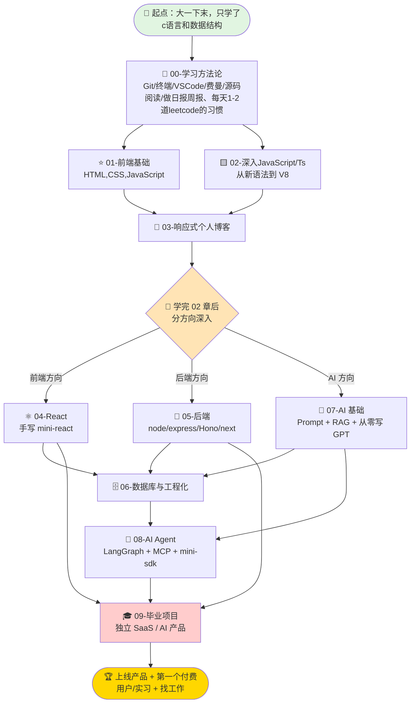

# My goal and road

## 说明：

这个仓库一方面用于记录我的全栈学习路程，看得到的记录也是对自己的一种激励，一方面也是对自己的熟悉终端、git等工具的练习吧，也希望能通过自己的分享和记录，让一些和我在大一的时候一样迷茫的同学开始确定自己的路线，以及开始自己的学习计划💪

## 目标：

我希望在明年暑假结束之前完成全栈的学习，甚至完成agent开发，以及项目实践，`路漫漫兮修远兮，吾将上下而求索`

## 下面是我的规划线路图:

因为我还是在校大学生，学校还是在开设计算机基础课比如：计算机组成原理、计算机网络等，所以我的计划不会安排这些课内已经有的内容。

## 当前进度：

- [x] 学习方法论+习惯养成
- [x] Git、终端、vscode、github使用学习
- [ ] 前端基础(HTML,CSS,JavaScript)
- [ ] 深入js，ts，以及浏览器渲染
- [ ] 完成第一个tip：做出自己的响应式个人博客
- [ ] 前端：react框架
- [ ] 后端：node,ts + 框架
- [ ] ai 基础学习：prompt，rag，从零写GPT
- [ ] 数据库+工程化
- [ ] 项目+1 传统全栈 or 完全前端
- [ ] 学习agent:LangGraph,MCP,mini-sdk手搓agtnt
- [ ] 项目+1 agent相关全栈
- [ ] 实习